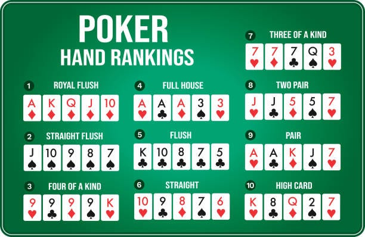

# Poker Hands Ranking Kata

  
"[Image Name](https://xxx)" by [Image Author](https://xxx/) is licenced under [License Name](https://xxx)
_`Replace above picture and references with something more relevant for this kata`_

## Introduction

### Domain 

A **_Hand_** is a set of 5 **_Cards_** a player holds.

Each **_Card_** has the following two properties:
1. **Value**: Represents the card's ranking, which ranges from 2 to 14.
   1. **Ace:** annotated as '**A**' and has the value of **14**
   2. **King**: annotated as '**K**' and has the value of **13**
   3. **Queen**: annotated as '**Q**' and has the value of **12**
   4. **Jack**: annotated as '**J**' and has the value of **11**
   5. **Ten**: annotated as '**T**' and has the value of **10**
   6. **2 -> 9**:annotated and has a value of the integer itself.
2. **Suit**:
   1. **Hearts** (♥) annotated as '**H**'
   2. **Diamonds** (♦) annotated as '**D**'️
   3. **Clubs** (♠) annotated as '**C**'
   4. **Spades** (♣) annotated as '**S**'

### Input 

For this kata, a card will be represented by a string of 2 characters. 
The first character is the value's annotation, and the second is the suit's annotation.

For example, **5D** is a card having 5 as a value and a Diamond as a Suit.

A Hand is also a string of the 5 cards separated by a space. The cards are displayed in ascending order based on the value. 

For example, **"2D 8S TC QD AH"** 

### Matching Criteria

| Ranking | Hand Name           | Matching Criteria                                                                                                                                                                                                                                                                                                                                                                                                                                                                                           | Example                      |
|---------|---------------------|-------------------------------------------------------------------------------------------------------------------------------------------------------------------------------------------------------------------------------------------------------------------------------------------------------------------------------------------------------------------------------------------------------------------------------------------------------------------------------------------------------------|------------------------------|
| 1       | **Royal Flush**     | 1. 5 cards should be: A, K, Q, J, T   2. All cards should have same suit.   3. It is a Tie when the two hands have Royal Flush                                                                                                                                                                                                                                                                                                                                                                      | T ♥️ J ♥️ Q ♥️ K ♥️ A ♥️     |
| 2       | **Straight Flush**  | 1. The values of 5 cards should be straight   2. All cards should have the same suit.   3. In case both have Straight Flush:   3.1. The hand with the higher card wins.   3.2. It is a Tie when both have the same card values.                                                                                                                                                                                                                                                             | 6 ♦️ 7 ♦️ 8 ♦️ 9 ♦️ T ♦️     |
| 3       | **Four Of A Kind**  | 1. 4 of the 5 cards have the same value   2. In case both have Four of a Kind, the hand with the higher value of the 4 cards wins.                                                                                                                                                                                                                                                                                                                                                                      | 6 ♠️️ 6 ♦️ 6 ♣️️ 6 ♥️️ K ♠️️ |
| 4       | **Full House**      | 1. 3 of the 3 cards have the same value   2. The remaining 2 cards form a pair of same value   3. In case both have Full House, the hand with the higher value of the 3 cards wins.                                                                                                                                                                                                                                                                                                                 | 8 ♠️️ 8 ♥️ 8 ♣️️ Q ♥️️ Q ♠️️ |
| 5       | **Flush**           | 1. 5 cards have the same suit   2. In case both have Flush, the hand with higher card wins.                                                                                                                                                                                                                                                                                                                                                                                                             | 2 ♠️️ 5 ♠️ 9 ♠️️ T ♠️️ K ♠️️ |
| 6       | **Straight**        | 1. The values of 5 cards should be straight   2. All cards should not have the same suit.   3. In case both have Straight, the hand with higher card wins.                                                                                                                                                                                                                                                                                                                                          | 8 ♠️️ 9 ♦️ T ♣️️ J ♥️️ Q ♠️️ |
| 7       | **Three Of A Kind** | 1. 3 of the 5 cards have the same value   2. The remaining 2 cards should not have the same value.   3. In case both have Three of a Kind, the hand with the higher value of the 3 cards wins.                                                                                                                                                                                                                                                                                                      | 9 ♠️️ 9 ♦️ 9 ♣️️ T ♥️️ J ♠️️ |
| 8       | **Two Pair**        | 1. 2 of the 5 cards have the same value   2. Another 2 cards have the same another value   3. The 5th card has a different value from the 2 pairs.   4. In case both have Two Pairs:   4.1. The hand with the higher value of the highest pair wins   4.2. If the highest pair are equal, compare the values of the other pair   4.3 If the other pair have the same value compare the value of the 5th card.   4.4. If all cards are of equal values, the game ends with a Tie. | 3 ♠️️ 3 ♦️ 5 ♣️️ A ♥️️ A ♠️️ |
| 9       | **Pair**            | 1. 2 of the 5 cards have the same value   2. The remaining 3 cards have to different values    3. In case both have a Pair:   3.1. The hand with the higher value of the pair wins   3.2. If the pair have the same values, the hand with the highest value in the other cards wins   If all cards are of equal values, the game ends with a Tie.                                                                                                                                       | 2 ♠️️ 4 ♦️ 6 ♣️️ T ♥️️ T ♠️️ |
| 10      | **High Card**       | 1. Any other formation of cards   2. Compare the highest value of the hand cards   3. If highest card values are equal, compare the second highest cards and so on                                                                                                                                                                                                                                                                                                                                  | 2 ♠️️ 7 ♦️ 8 ♣️️ T ♥️️ Q ♠️️ |

## Getting Started

- [Java](java/GETTING_STARTED.md)

## Useful Links

### For this Kata

_`Add here any link deemed relevant for this kata`_

### General

- [TCR (Test && Commit || Revert) wrapper](tcr/TCR.md) utility
- Collaborative timer for pairing or mobbing: [mobti.me](https://mobti.me/)
  or [agility timer](https://agility.jahed.dev/)

## Session Information

### Topic

_`Indicate main topic of this kata here`_

### Focus Points

_`Indicate main focus points covered during this kata`_

### Source Files

- [Java](java)

## License

`Poker-Hands-Ranking-Kata` and the accompanying materials are made available
under the terms of the [MIT License](LICENSE.md) which accompanies this
distribution, and is available at the [Open Source site](https://opensource.org/licenses/MIT)

## Acknowledgements

See [ACKNOWLEDGEMENTS.md](ACKNOWLEDGEMENTS.md) for more information.
